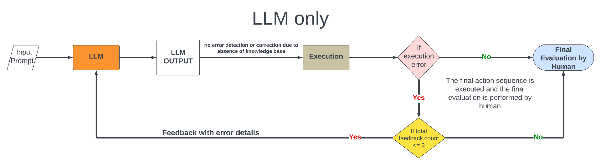
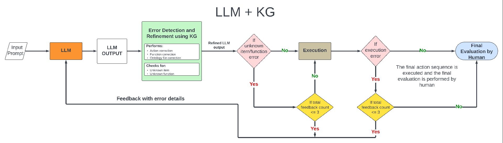
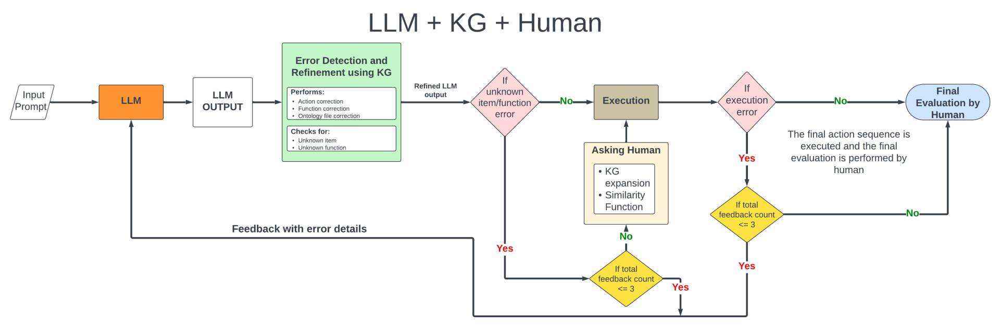
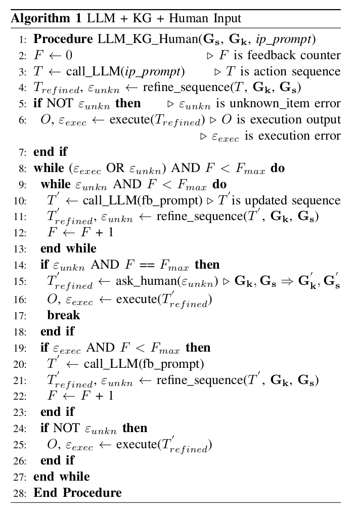
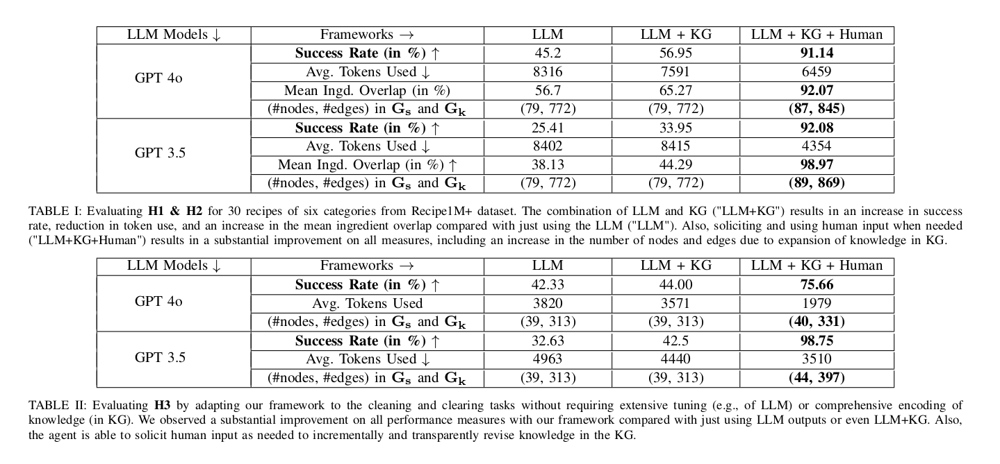

# **Baselines**





# **Proposed Model**



## **Pseudo_code**
<!--  -->



## ***Experimental Results***



## ***How to run the frameworks***

### **Individual Frameworks:**

To run individual frameworks, follow these steps:

1. **Navigate to the directory:**

```
cd code/GPT3.5/individual_frameworks/LLM_KG_Human

``` 
2. **Run the script** using the following format:

```
python3 stitching_everything_exp.py <input-prompt> <no-of-feedback> <state-file>

```

3. **Example command:**

```bash
python3 stitching_everything_exp.py "Give me cot and action sequence to prepare an omlette" 3 "intial_onto.ttl"

```
4. Adjust the `input-prompt`, `no-of-feedback`, and `state-file` parameters as needed for the specific case.

### **Streamlined Frameworks:**

To run the streamlined frameworks, follow these steps:

1. **Navigate to the directory:**

```bash
cd code/GPT3.5/cooking_domain

``` 
2. **Run the script** using the following format:

```bash
python3 stitching_everything.py <no-of-feedback> <state-file>

```
3. **Note:** All tasks are listed in the `kitchen.json` file located in the `code/GPT3.5/cooking_domain directory`.

4. **Example command:**

```bash
python3 stitching_everything.py 3 "initial_onto.ttl"

```


### **Installing Dependencies:**

You can install the dependencies using the following command:

```bash
pip install -r requirements.txt
```


